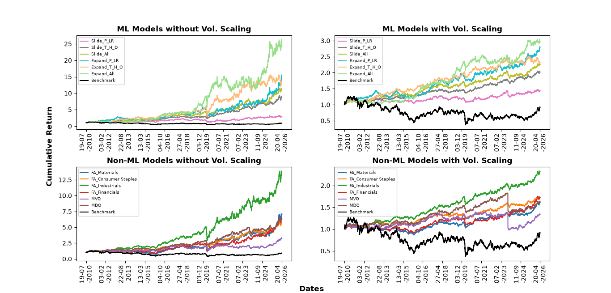
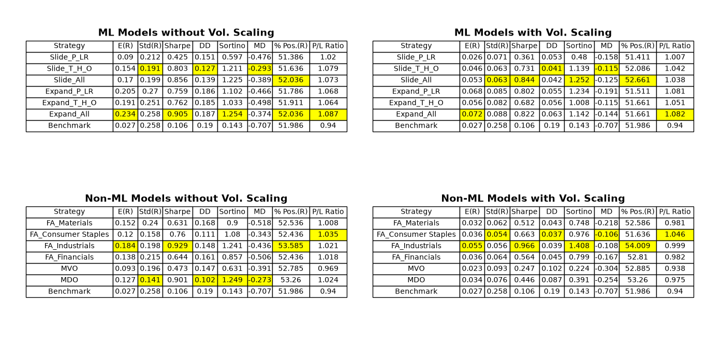

# Table of Contents
1. [Project Background](#project-background)
    * [Insights, Reccomendations and Focus Areas](#insights-reccomendations-and-focus-areas)
2. [Data Structure](#data-structure)
3. [Executive Summary](#executive-summary)
    * [Overview of Discoveries](#overview-of-discoveries)
    * [Discovery Trends](#discovery-trends)
4. [Insights Details](#insight-details)
    * [0.966 Ratio Sharpe in Industrial Sector](#0966-ratio-sharpe-in-industrial-sector)
    * [COVID-19 Impact](#covid-19-impact)
    * [Benchmark Weakness](#benchmark-weakness)
5. [Models, Predictions and their Impacts](#models-predictions-and-their-impacts)
    * [Sliding Window Models](#sliding-window-models)
    * [Expanding Window Models](#expanding-window-models)
    * [Results](#results)
6. [Recommendations](#reccomendations)
    * [User Preferences Guide Strategy](#user-preferences-guide-strategy)
    * [Industrial Sector Focus](#industrial-sector-focus)
    * [ML Qualities with Better Results](#ml-qualities-with-better-results)
7. [KPIs](#kpis)
    * [Ratio Sharpe](#ratio-sharpe)
    * [Cumulative Return](#cumulative-return)
    * [P/L Ratio](#pl-ratio)
8. [Assumptions](#assumptions)

## Project Background
Capital Andina (CA) is an asset management firm in Peru that specializes in equity investments and portfolios in the South American financial sector. Its diversification strategy includes financial companies listed on exchanges in Brazil, Chile, Colombia, and Peru. The firm primarily uses the SPLAC index, which comprises the 40 largest companies in Latin America, as its benchmark.

CA recognizes the positive impacts of Machine Learning (ML) and wants to integrate it into its portfolio strategies. Additionally, the firm believes that the current benchmark is not the most appropriate for financial market movements, as its current strategies consistently outperform it. CA aims to develop a data-driven portfolio analysis framework that enables detailed, informed decisions regarding the use of ML versus traditional strategies.

Given the complexity of investments, portfolio strategies will be evaluated using the following financial metrics: expected return (E(R)), volatility (Std(R)), Sharpe ratio, downside deviation (DD), Sortino ratio, maximum drawdown (MD), percentage of positive returns (% Pos. (R)), and profit-to-loss ratio (P/L Ratio). There will be an emphasis on the ratio Sharpe, since it succintly captures returns per unit risk. Additionally, **volatility will be scaled** to eliminate market volatility and focus on the characteristics of each strategy.

 

### Insights, Reccomendations and Focus Areas
**Business Sectors**: One of the strategies used by CA focuses on a fixed weight allocation over the entire period. They determine this allocation based on each company’s sector, including the following sectors: energy, finance, healthcare, materials, utilities, etc. Analysis shows that investment focused on the industrial sector yields better returns and a higher Sharpe ratio across all non-ML strategies.

**ML vs. Non-ML**: The difference between these two strategies is evident in specific metrics. While ML strategies outperform in **Sharpe ratio and cumulative return**, non-ML strategies perform better in **volatility and percentage of positive returns**. The appropriate strategy depends on the user’s investment preferences.

**Benchmark**: CA’s foresight becomes a certainty wheit is discovered that all current strategies outperformed the benchmark. Despite this, the benchmark serves as a useful reference point because it captures market turbulence, such as the COVID-19 pandemic. When such turbulence occurs in other strategies, they can be compared to the benchmark to identify the root causes of these fluctuations.

 

## Data Structure
SPLAC is a financial index consisting of the top 40 South American companies with the highest market capitalization and liquidity. The composition of this index varies over time; therefore, the companies selected were those that were among these 40 on August 31, 2026. Recognizing that not all of these companies were founded at the same time, a filter was applied to select companies that were active as of February 28, 2006. This date was chosen to ensure that the 2008 crisis was included in the data.

The historical data was downloaded from YFinance, with the following details:
* Dates (post-filtering): 2/28/2006 – 8/28/2026
* Companies (post-filtering): AMXB.MX, AXIA3.SA, BBAS3.SA, BIMBOA.MX, BSAC, CEMEXCPO.MX, CENCOSUD.SN, CIB, FEMSAUBD.MX, GCARSOA1.MX, GGB, ISA. CL, PAC, PBR, RENT3.SA, SCCO, SQM, VALE, VIV, WALMEX.MX, WEGE3.SA
* Indicators: Adjusted Close, Close, High, Low, Open, and Volume.

  

Data processing, model components details, and training schema are [HERE](./tf_models.py)

Model's graph is found [HERE](./Images/ModelGraph.png)

Non-ML strategies and all evaluations are [HERE](./evaluations.py)

## Executive Summary
### Overview of Discoveries
Different sectors of these South American companies experience periods when they are stronger or weaker than other sectors. Despite this variation, the **industrial sector** has achieved greater success and returns than all others, indicating that it is a good sector for investment.

On the other hand, strategies developed using ML models offer a competitive alternative to traditional models. On average, cumulative returns (with volatility scaling) from ML strategies reached **229.17%** of the initial investment, while strategies without ML yielded **172.23%**. Additionally, Sharpe ratios also confirm this difference, with ML strategies averaging **0.707**, while non-ML strategies averaged **0.566**.

Conversely, non-ML strategies outperform ML strategies in the following categories: Volatility (0.068 vs. 0.075) and Percentage of Positive Returns (52.86% vs. 51.83%). Different metrics carry varying levels of importance for each user, indicating that the best strategy depends on the user’s preferences.

 

### Discovery Trends
**Strength of the Industrial Sector**: With a fixed weight allocation in companies within the industrial sector, it has **1.37 times** (with scaled volatility) and **2.17 times** (without scaling volatility) better cumulative returns than the other sectors: financials, materials, and consumer staples.

**Impact of COVID**: All strategies felt the economic impact of the pandemic, which began in **March 2020**. Despite its negative influence, all strategies also began to recover from the pandemic starting in **April 2020**.

**Benchmark**: The benchmark used was the SPLAC index for the financial sector in South America. Comparisons reveal that **all** direct investments (in the 40 companies included in the SPLAC index) yielded better results than a direct investment in the index.

## Insight Details
### 0.966 Ratio Sharpe in Industrial Sector
Among the fixed-allocation strategies, focusing on the industrial sector resulted in the strongest portfolio out of all the strategies without ML.

* **Sharpe Ratio**: This strategy achieved the **highest Sharpe ratios of 0.966 and 0.929** (with and without scaling volatility, respectively).
* **Expected Return**: Similarly, this strategy achieved the best expected annual returns, at 0.184 and 0.055 (with and without scaling volatility, respectively).

 

### COVID-19 Impact
The COVID pandemic had an impact on every aspect of the global economy, including the financial sector.

* **All strategies**, with or without ML, captured the drastic impacts of COVID-19.
* Strategies **with scaled volatility** were **less affected** by these impacts, experiencing a more moderate decline and fewer losses.
* All strategies, including the benchmark, saw their losses recovered as the pandemic came to an end.

 

### Benchmark Weakness
In the benchmark, the SPLAC index posted the best results within the first year of the date range, but over time it was outperformed by all the other models. Given that **all** the other models outperform the index, it is clear that this benchmark does not employ the best strategies for managing the performance of the top 40 companies in South America.

## Models, Predictions and their Impacts
There are several ways to create a model that captures temporal dependencies within a dataset. In this case, two main strategies were studied: sliding windows and expanding windows. Additionally, different combinations of the following **financial metrics** for each stock were investigated: Closing Price (P), Logarithmic Returns (LR), TEMA (T), HLC3 (H), and OBV (O).

 

### Sliding Window Models
In this strategy, the data windows shifted annually, meaning that only data from the past two years were used to train the model. Three different models were created using this strategy. The architectures were identical, but the processed data differed as follows: Data Set 1 used the P and RL indicators; Data Set 2 used the T, H, and O indicators; and Data Set 3 used all the indicators.

 

### Expanding Window Models
In this strategy, the windows were expanded annually to capture all data from the beginning (where data is available) up to the day before the test data begins. Similar to the other strategy, three different models were created with identical architectures but different features in each dataset.

 

### Results
The sliding-window models achieved an **average Sharpe ratio of 0.645 and 0.695 ** (with and without volatility scaling, respectively), while the expanding-window models had **0.769 and 0.809** (with and without volatility scaling, respectively). In other words, the second strategy predicts (stock) weights that result in portfolios with higher Sharpe ratios.

Conversely, it was found that in both strategies, the models that used all indicators achieved a Sharpe ratio **more than 1.39 (sliding windows) and 1.19 (expansive windows) times** higher than all others. In fact, the sliding-window model that used all indicators performed better than the expansive-window models that did not use all indicators.

Additionally, the **expansive-window model** performs better when **without scaled volatility** (with ratios of 0.905 and 1.254). Conversely, the **model with sliding windows** performs best when **volatility is scaled** (with ratios of 0.844 and 1.252).

## Reccomendations
### User Preferences Guide Strategy
All the strategies presented stand out based on 10 different metrics, but no single strategy is the best across all of them. To develop the best strategy, it is recommended to identify the user’s characteristics and preferences.

**Fixed-allocation strategies have the best ratios** (with and without volatility scaling), but they have one of the lowest MD values at -0.436. A user who seeks to minimize the stress caused by a price drop will not prefer this strategy.

On the other hand, a user may prioritize the profit-to-loss ratio (“P/L Ratio”), keeping in mind that this may come at the expense of an optimal Sharpe ratio. There are various combinations that can be formed based on the user’s goals.

 

### Industrial Sector Focus
The industrial sector is experiencing a strong rally, yielding a **250% cumulative return** on the initial investment. In the short term, it is recommended to invest the vast majority of the funds into the industrial sector, provided there is diversification with other stocks. In the long term, it is recommended to continue monitoring the sector’s performance, keeping in mind that a shift in the market could begin to bolster another sector.

 

### ML Qualities with Better Results
It was observed that the ML models, under both windowing strategies (sliding and expansive), achieved better performance when using **all indicators**. It is recommended to collect more indicators to improve the models’ predictions.

Additionally, it is noted that **expansive windows yielded better results than sliding windows**. This pattern would help capture historically drastic changes, signaling the model to adjust its predictions. In other words, having more historical stock data improves the model’s performance.

## KPIs
### Ratio Sharpe
(Expected Returns)/(Return Volatility)

Objective: Increase the Sharpe ratio of the current portfolio by 67%. To achieve these results, the four best models will be used to determine the weightings of the stocks with the highest returns without increasing volatility.

 

### Cumulative Return
\prod_{i=1}^t (1 + simple_return_i)

Focus: Improve the portfolio's cumulative return. This will naturally follow as portfolio returns improve.

 

### P/L Ratio
(Average Profits)/(Average Losses)

Focus: This metric affects the user's psychological well-being, as it shows how often the strategy yields positive returns.

 

## Assumptions
This analysis was based on the following assumptions:

* YFinance's “Adjusted Close” reflects the stock price used by stock buyers and sellers.
* Stock market data is non-stationary and inherently unpredictable.